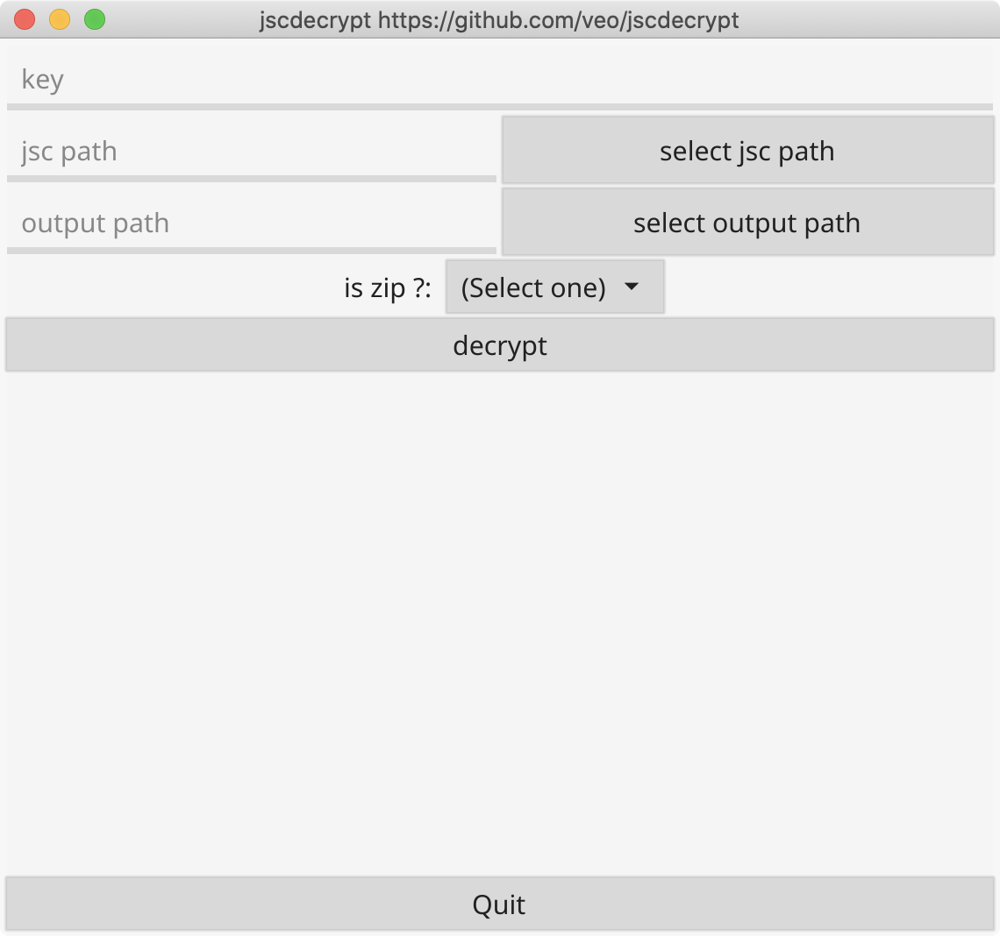

# jscdecrypt
jsc decrypt tool

use [fyne-cross](https://github.com/lucor/fyne-cross)
Supported targets are:

darwin/amd64
darwin/386
freebsd/amd64
linux/amd64
linux/386
linux/arm
linux/arm64
windows/amd64
windows/386
android
ios

## build
### use fyne-cross

```
go get github.com/lucor/fyne-cross/v2/cmd/fyne-cross
```

```
fyne-cross --targets=linux/amd64,windows/amd64,darwin/amd64 -arch=amd64,386
```
### normal build 

```
go build -ldflags="-H windowsgui"

```
## screen
It should look like this:

<p align="center" markdown="1">
  
</p>
